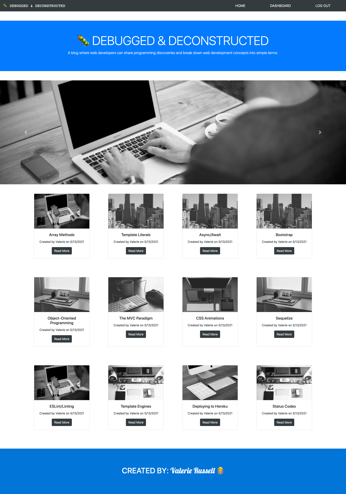
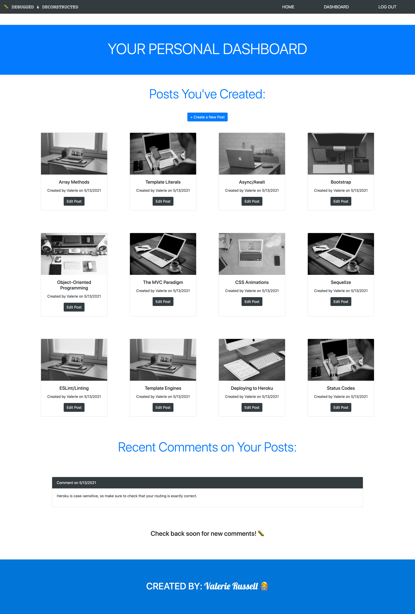
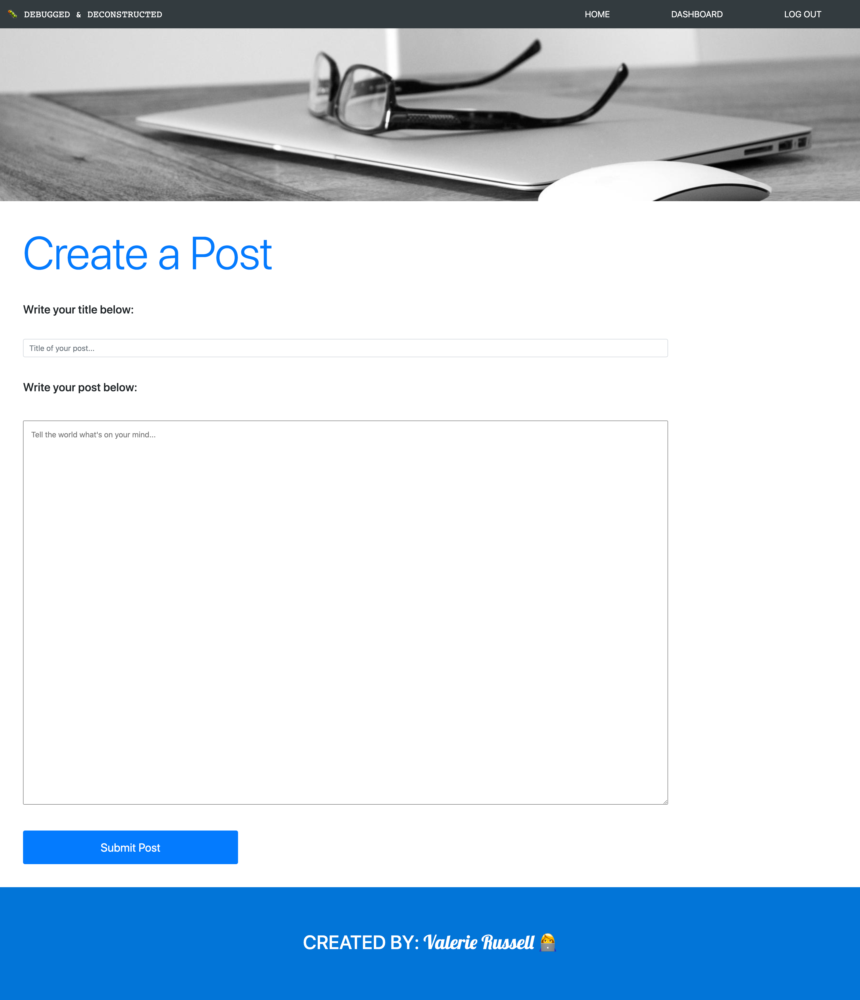
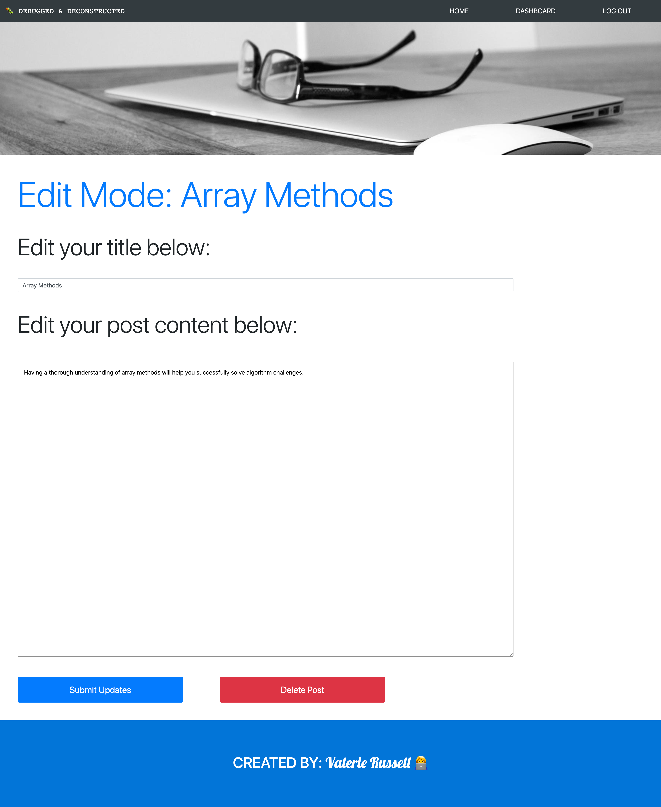

# Web Development Blog

## Description

This full-stack application utilizes back-end technologies such as Node.js, Express.js, and Sequelize, along with Handlebars as a template engine to render HTML dynamically. The application also uses Bootstrap for styling, as well as Lorem Picsum for placeholder images. A user cannot access their personal dashboard and read the blog posts on the site until they have logged in or signed up. 

Once they have logged in, then the user can access their personal dashboard and can view all posts on the site. The user's personal dashboard includes the posts they have authored, along with the top five most recent comments on their posts. Users can write posts, edit existing posts that they have authored, and delete posts that they have authored.

I learned a lot about what it takes to create full-stack applications by creating this blog, and I also learned some things about Bootstrap that I didn't know before. I really enjoyed designing the pages for the site, and I loved being able to use Lorem Picsum so that realistic images could be used as placeholders. After troubleshooting several errors as I built the site, I became more confident in my abilities to problem-solve and to use the technologies mentioned above.

One of the biggest challenges was figuring out how to display the five most recent comments for each author. I found the blog post IDs that matched the author, then found the comments on those blog posts, then took the array of comments and uses .slice() and .reverse() so that the five most recent comments are displayed in order from most recent to least recent. If the user does not have five comments, then all comments in the array are displayed. If the user has no comments on their posts yet, then they will just see the message on the page to check back soon.

A few ideas for future development include:

- Learning how to store content that is several paragraphs long (i.e. a full blog post) 
- Creating stats for each user (# of posts created, # of comments)
- Writing several posts about my personal experiences as a web developer

## Table of Contents

- [Installation](#Installation)
- [Usage](#Usage)
- [License](#License)
- [Contributing](#Contributing)
- [Tests](#Tests)
- [Questions](#Questions)
            
## Installation

For this application to run correctly on your local machine, run ```npm init -y ``` in the working directory of your choice. Next, install the relevant dependencies by running ```npm i```. Alternatively, you can install the dependencies one at a time. Please note that it may take a few minutes for all dependencies to download on your local machine.

You will also need to create a .env file and include your username, password, and database name for MySQL:

Your .env file will look something like this:

```
DB_USER=''
DB_PW=''
DB_NAME=''
```

You will need to create the database in your own MySQL Workbench to ensure that the application runs properly.

To start the application from the command line after all installations have been complete, run the command ```npm run seed``` to seed data to the database you created, then run ```npm start```. You can then use a tool such as Insomnia to test all routes. This application runs locally at port 3001.

A view of the home page:



An example dashboard:



Writing a post:



Editing/deleting a post:



This application is also deployed on Heroku: https://debugged-and-deconstructed.herokuapp.com/
            
## Usage

This application was created for educational purposes and can currently handle blog posts that are short (1–3 sentences).

## License

This project has not yet been licensed, and thus, standard copyright laws apply.
            
## Contributing

Valerie Russell is the sole contributor to this project.
            
## Tests

There are currently no tests written for this project.
            
## Questions

If you have any questions about this application my GitHub username is vruss14 and you can view my GitHub profile at https://github.com/vruss14.

If you have additional questions, feel free to reach out to me at vruss14@gmail.com.
